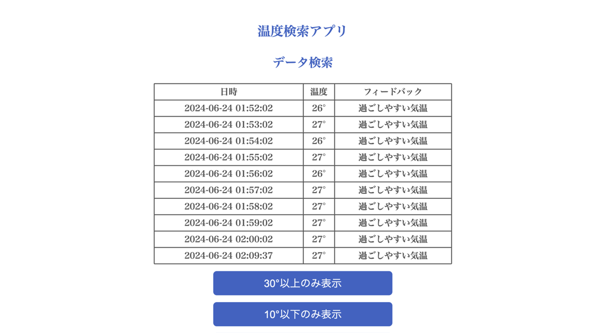
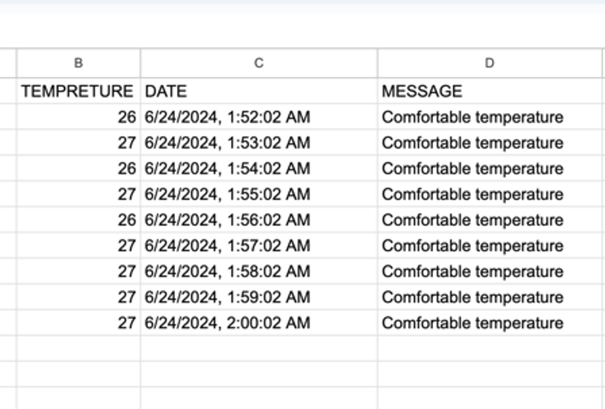

# IoT-Flask-Sheets-Integration
## 概要
- Obniz Boardで取得したデータをNode-RedでAPIを利用しGoogleスプレッドシートに記録
- Googleスプレッドシートに記録に記録したデータをAPIを通してFlaskで取得しブラウザで表示

## プログラムの内容
- Node-RedでObniz Boardを制御するJSプログラムとFlaskのコード

## 必要なパッケージ
```
pip install Flask
pip install gspread
```

## イメージ
- ブラウザの画像


- スプレッドシートの画像

